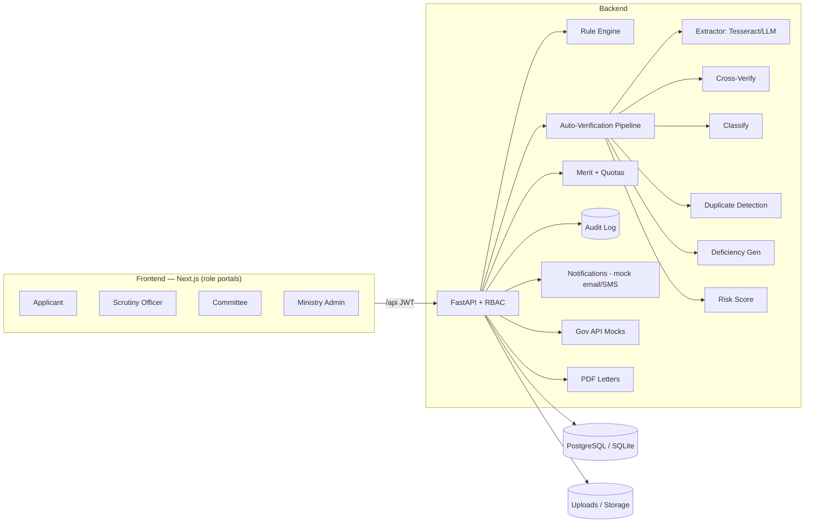

# AI-Enabled Scholarship & Fellowship Management System for Scheduled Tribes

**Smart India Hackathon 2026 · Problem Statement 26239 · Ministry of Tribal Affairs (MoTA)**
Theme: Smart Education · Category: Software

> One secure, transparent and intelligent platform for MoTA's Scheduled-Tribe
> scholarship & fellowship schemes (**NFST**, **NOS**). Scheme eligibility rules,
> required documents and selection criteria are **fully configurable (no code)**.
> An AI layer assists verification — but **every automated decision is
> human-reviewable, overridable and audited.**

⚠️ Prototype for a hackathon. Sample rule values are labelled **SAMPLE**; mock
integrations (DigiLocker/e-District/DBT-PFMS, email/SMS) are labelled **MOCK**.

---

## Table of contents
- [Highlights](#highlights)
- [Tech stack](#tech-stack)
- [Architecture](#architecture)
- [Prerequisites](#prerequisites)
- [Setup — Linux / macOS](#setup--linux--macos)
- [Setup — Windows](#setup--windows)
- [Run with Docker (any OS)](#run-with-docker-any-os)
- [Verify it works](#verify-it-works)
- [Demo logins](#demo-logins)
- [Troubleshooting](#troubleshooting)
- [User manual](#user-manual)
- [5-minute demo script](#5-minute-demo-script)
- [Modules](#modules)
- [Testing](#testing)
- [What is real vs mocked](#what-is-real-vs-mocked)

## Highlights
- **Scheme Configuration Engine** — create/edit schemes without code: JSON eligibility
  rules, required documents (with OCR fields), merit weights, tie-breaks & quotas.
- **Applicant portal** — instant eligibility pre-check with reasons, dynamic form
  generated from scheme config, document upload with instant AI feedback, visual
  application tracker, deficiency inbox, notifications, English/हिंदी toggle.
- **AI/automation** — OCR extraction, cross-verification (name/income/expiry),
  document classification, duplicate detection (Aadhaar/bank/file), explainable risk
  score, auto-deficiency generation. **AI assists only.**
- **Officer workbench** — risk-prioritised queue with filters, split-screen review
  (document ↔ extracted data ↔ AI flags), verify / raise-deficiency / reject, SLA
  timers, bulk-verify, and **logged overrides** of any AI flag.
- **Screening & selection** — transparent weighted merit list with per-applicant
  breakdown, configurable tie-breaks & reservation quotas, committee adjust (with
  mandatory justification), publish → notify → selection-letter PDF.
- **Post-selection** — fellowship lifecycle (joining, progress, JRF→SRF), mock DBT
  disbursement tracker, grievance module.
- **Dashboards & audit** — KPIs, charts (scheme/state/gender/tribe/course, funnel,
  deficiencies), officer performance, CSV/PDF export, and an **immutable audit log**.
- **Security** — JWT + RBAC on every endpoint, PII encrypted at rest & masked in UI,
  file type/size limits.

## Tech stack
| Layer | Choice |
|---|---|
| Frontend | Next.js 14 (App Router), TypeScript, Tailwind CSS, Recharts, lucide-react |
| Backend | FastAPI, SQLAlchemy 2, Pydantic v2 (Python 3.13) |
| Database | PostgreSQL (docker-compose) · SQLite fallback (zero-setup local dev) |
| OCR | Tesseract (pytesseract) + pdf2image, ground-truth sidecars for offline demo |
| Auth | JWT + role-based access control |
| Storage | Local `/uploads` behind a storage interface (S3-ready) |

## Architecture



Full ER diagram: [docs/ARCHITECTURE.md](docs/ARCHITECTURE.md).

## Prerequisites

The app runs two processes: a **Python backend** (port 8000) and a **Node frontend**
(port 3000). You need these installed first:

| Tool | Version | Why | Get it |
|---|---|---|---|
| **Python** | **3.13** (3.11/3.12 also fine; **not 3.14**) | Backend runtime | [python.org/downloads](https://www.python.org/downloads/) |
| **Node.js + npm** | 18 LTS or newer | Frontend runtime | [nodejs.org](https://nodejs.org/) |
| **Git** | any | To clone the repo | [git-scm.com](https://git-scm.com/) |
| Docker *(optional)* | any recent | One-command run (Option C) | [docker.com](https://www.docker.com/) |
| Tesseract + Poppler *(optional)* | any | **Real** OCR (demo works without them) | see [Real OCR](#optional-enable-real-ocr) |

> ⚠️ **Python 3.14 is not supported** — some dependencies have no 3.14 wheels yet. Use
> 3.13/3.12/3.11. Check your version with `python3 --version` (Linux/macOS) or
> `py -0` (Windows).

The database is **SQLite by default** — nothing to install. (PostgreSQL is used only in
the Docker option.) OCR works out of the box using bundled ground-truth sidecars, so
Tesseract is optional.

There are **three ways to run it** — pick one:
- **A. Linux / macOS** (manual, no Docker) — fullest control.
- **B. Windows** (manual, no Docker).
- **C. Docker** (any OS) — one command, includes PostgreSQL.

---

## Setup — Linux / macOS

Open a terminal in the project root (the folder containing `backend/`, `frontend/`,
`README.md`). If your folder name has a space (e.g. `sih 2`), the `cd` commands below
already handle it.

### 1. Backend (terminal 1)
```bash
cd backend
python3.13 -m venv .venv                 # or: python3 -m venv .venv
source .venv/bin/activate
pip install --upgrade pip
pip install -r requirements.txt
cp .env.example .env                      # default config (SQLite) — edit if needed
python -m app.seed.seed                   # loads NFST/NOS + ~200 synthetic applicants (~2–3 min)
uvicorn app.main:app --port 8000 --reload
```
Leave this running. Backend is up at **http://localhost:8000** (docs at `/docs`).

### 2. Frontend (terminal 2)
```bash
cd frontend
npm install
npm run dev
```
Open **http://localhost:3000**.

### Shortcut with `make` (Linux/macOS only)
From the project root, `make` wraps all of the above:
```bash
make setup     # venv + backend deps + frontend deps + copies .env
make seed      # (re)load the demo database
make backend   # run backend  (terminal 1)
make frontend  # run frontend (terminal 2)
make test      # run backend tests
```

---

## Setup — Windows

Use **PowerShell**. `make` is not available on Windows, so run the commands directly.
Open PowerShell in the project root (Shift-right-click the folder → *Open PowerShell here*).

### 1. Backend (PowerShell window 1)
```powershell
cd backend
py -3.13 -m venv .venv                 # or: python -m venv .venv
.\.venv\Scripts\Activate.ps1
python -m pip install --upgrade pip
pip install -r requirements.txt
copy .env.example .env
python -m app.seed.seed                # loads demo data (~2–3 min)
python -m uvicorn app.main:app --port 8000 --reload
```
Leave it running. Backend is at **http://localhost:8000**.

> If `Activate.ps1` is blocked by execution policy, run once:
> `Set-ExecutionPolicy -Scope CurrentUser -ExecutionPolicy RemoteSigned` and retry.
> (Or use `cmd.exe` and `\.venv\Scripts\activate.bat` instead.)

### 2. Frontend (PowerShell window 2)
```powershell
cd frontend
npm install
npm run dev
```
Open **http://localhost:3000**.

---

## Run with Docker (any OS)

Requires Docker Desktop / Docker Engine. From the project root:
```bash
docker compose up --build
```
This starts **PostgreSQL + backend (seeds on first boot) + frontend**. First build takes
a few minutes. Open **http://localhost:3000**. Stop with `Ctrl+C`, or `docker compose down`
(add `-v` to also wipe the database volume).

---

### (Optional) Enable real OCR
The OCR demo works offline via ground-truth sidecars. To run **actual** Tesseract OCR on
uploaded files:
- **Linux (Debian/Kali/Ubuntu):** `sudo apt-get install -y tesseract-ocr poppler-utils`
- **macOS:** `brew install tesseract poppler`
- **Windows:** install the [UB-Mannheim Tesseract build](https://github.com/UB-Mannheim/tesseract/wiki)
  and [Poppler for Windows](https://github.com/oschwartz10612/poppler-windows/releases),
  then add both `bin` folders to your `PATH`.

No config change is needed — the extractor auto-detects Tesseract when present.

## Verify it works
With both processes running:
- **Backend health:** open http://localhost:8000/health → should show `{"status":"ok",...}`.
- **API docs:** http://localhost:8000/docs (interactive OpenAPI).
- **Frontend:** http://localhost:3000 → the login page with four demo-login buttons.
- **Backend tests** (optional): `cd backend && python -m pytest app/tests -q` → 24 passing.

> First page load in **dev mode** can be slow (Next.js compiles each route on first
> visit — tens of seconds on a busy machine). This is normal and only happens once per
> route. For a fast, presentation-ready run, use the [production build](#tip-fast-demo-build).

## Demo logins
Shown on the login page. Password for all: **`demo1234`**.

| Role | Email |
|---|---|
| Ministry Admin | `admin@demo.gov.in` |
| Scrutiny Officer | `scrutiny@demo.gov.in` |
| Committee Member | `committee@demo.gov.in` |
| Applicant (ST student) | `applicant@demo.gov.in` |

The `applicant@demo.gov.in` account intentionally has **no application yet**, so you can
walk the full "apply → deficiency → resubmit" flow live. The ~200 seeded applicants power
the officer queue, merit lists and dashboards.

## Troubleshooting

| Symptom | Fix |
|---|---|
| `pip install` fails building `pydantic-core` / `Pillow` / `psycopg2-binary` | You're on **Python 3.14**. Recreate the venv with 3.13: delete `backend/.venv`, then `python3.13 -m venv .venv` (Linux) / `py -3.13 -m venv .venv` (Windows). |
| `python3.13: command not found` | Install Python 3.13, or use `python3` / `py` if it points to 3.11–3.13. Verify with `python3 --version`. |
| `Address already in use` on 8000 or 3000 | Another server is running. Stop it, or pick a new port: backend `uvicorn app.main:app --port 8001`; frontend `npm run dev -- -p 3001`. Find the process: `lsof -ti :3000` (Linux/macOS) or `netstat -ano \| findstr :3000` (Windows). |
| Login page loads but login fails / "Failed to fetch" | The **backend isn't running** or is on a different port. Ensure terminal 1 shows uvicorn on `:8000`; check http://localhost:8000/health. |
| `Activate.ps1 cannot be loaded` (Windows) | Run `Set-ExecutionPolicy -Scope CurrentUser -ExecutionPolicy RemoteSigned`, or use `cmd.exe` with `.venv\Scripts\activate.bat`. |
| Pages compile very slowly in the browser | Dev mode compiles on demand. Use the [production build](#tip-fast-demo-build) below for a snappy demo. |
| Charts/OCR/PDF look odd or empty | Re-seed the database: `python -m app.seed.seed` (from `backend/`, venv active). |
| Want to start completely fresh | Delete `backend/scholarship.db` and `backend/uploads/`, then re-seed. |

### Tip: fast demo build
Dev mode recompiles routes on first visit. For a smooth presentation, build once and serve
the optimized bundle (frontend):
```bash
cd frontend
npm run build
npm start          # serves http://localhost:3000, no per-page compile
```
(Keep the backend running as usual.)

---

## User manual

The portal has **four roles**, each with its own home screen after login. Switch roles by
logging out (top-right icon) and picking another demo login. The **language toggle**
(top bar) switches the whole UI between **English and हिन्दी**. Sensitive numbers are
labelled **SAMPLE** (placeholder values) and integrations that are simulated are labelled
**MOCK**.

### 👤 Applicant (ST student)
Your home is a two-part dashboard.

1. **My Applications** — cards for each application you've started, with a colour-coded
   status and a badge if any deficiencies need your attention. Click a card to open its
   tracker.
2. **Schemes you may be eligible for** — every active scheme with an **Eligible / Not
   eligible** badge computed from your profile. Click **"Why? eligibility check"** to see
   each rule pass/fail with a plain-language reason.

**Applying:**
1. Click **Apply** on a scheme. A **3-step form** opens.
2. **Step 1 – Details:** the fields are **generated from the scheme's rules** (it asks
   exactly what's needed). Fill them and **Save draft** any time.
3. **Step 2 – Documents:** upload each required document. You get **instant feedback** —
   detected document type, readability %, and the fields the system extracted (name,
   certificate number, income, etc.). "Mandatory" documents are marked.
4. **Step 3 – Review & Submit:** check your entries and **Submit**. The system runs
   automated verification immediately.

**After submitting — the tracker:**
- A **visual timeline** shows where you are (Submitted → Auto-Verified → Under Scrutiny →
  … → Selected / Fellowship Active).
- **Deficiency Inbox** lists anything that needs fixing, in plain language. For a document
  issue, **re-upload just that file**, optionally add a note, then click **Resubmit**.
- **Documents & extracted data** shows what was read from each file (click **View** to
  open the file).
- If you're **Selected**, a **Download selection letter** (PDF) button appears.
- The **🔔 Notifications** page (top bar) lists in-app alerts; email/SMS are simulated
  and marked **MOCK**.

### 🔎 Scrutiny Officer
Your home is the **Scrutiny Queue**.
1. Applications are **sorted by risk** and show **status, risk level, active AI flags,
   open deficiencies, and an SLA timer** (how long they've been pending).
2. Filter by **scheme, status, or minimum risk** using the dropdowns.
3. Tick several clean rows and use **Bulk verify** to clear auto-verified cases at once
   (rows with deficiencies or high-severity flags are skipped automatically).
4. Click **Review** to open the **split-screen**:
   - **Left:** the document preview (switch between the applicant's uploaded files).
   - **Right:** **AI flags** (each with a reason + confidence), the **extracted data vs
     the form data**, and the **risk explanation** ("why this score").
5. Take an action:
   - **Verify** — passes scrutiny (moves to Screened).
   - **Raise Deficiency** — pick a document (or "general"), write what's wrong; the
     applicant is notified and can resubmit. Add multiple items at once.
   - **Reject** — requires a reason.
   - **Override** (on any AI flag) — requires a **justification**; the flag is set aside
     and the override is **written to the audit log**. *AI assists; you decide.*

### 🏛️ Committee Member
Your home lists the schemes; open one to manage **Merit & Selection**.
1. **Generate / Refresh** builds the merit list from the scheme's configured **weights**,
   over all screened applications, applying **tie-breaks and reservation quotas**.
2. Each row shows **rank, score, status and quota tag**. Click **Breakdown** to see the
   transparent per-criterion math (raw value → normalized → weight → contribution).
3. **Adjust** an entry to mark it selected / not-selected — a **justification is
   mandatory** and recorded in the audit log.
4. **Publish results** — applicants within the slot count are marked **Selected**,
   everyone is **notified**, selection-letter PDFs become available, and fellowships are
   created for selectees.

### 🗂️ Ministry Admin
Three areas via the top nav.
1. **Dashboard** — KPI tiles (total applications, auto-verified %, pending scrutiny, avg
   processing time, deficiency rate, selected, funds committed) plus charts (selection
   funnel; by scheme / state / gender / tribe / course; top deficiency reasons; officer
   performance & backlog). **Export CSV / PDF** from the top-right.
2. **Schemes** — the **Scheme Configuration Engine**. Open a scheme (or **New scheme**)
   to edit — **with no code** — its basics, **eligibility rules** (`field / operator /
   value / label`), **required documents** (and which fields OCR should extract), and
   **merit criteria** (weights, tie-breaks, quotas). Save to apply immediately. Sample
   values carry a **SAMPLE** badge.
3. **Audit** — the **immutable log** of every status change, AI-flag override and
   configuration change, with actor, timestamp and before/after values. Filter by entity.

## 5-minute demo script
Detailed runbook: [docs/DEMO.md](docs/DEMO.md). In short:

1. **Admin configures a scheme** — login as *Admin* → **Schemes** → open **NFST** →
   show eligibility rules, documents and merit weights are pure config; tweak a value
   & save. (No code changed.)
2. **Applicant applies** — login as *Applicant* → see **eligible schemes with reasons**
   → **Apply** → dynamic form (generated from the scheme's rules) → upload documents
   and watch **instant AI feedback** (detected type, readability, extracted fields) →
   Submit.
3. **AI flags a deficiency** — the auto-verification pipeline raises a plain-language
   deficiency (e.g. missing/mismatched document). Applicant sees it in the
   **deficiency inbox**, **re-uploads** just that file, and **resubmits**.
4. **Officer verifies** — login as *Officer* → risk-prioritised **queue** → open an
   application → **split-screen** (document ↔ extracted data ↔ AI flags with reasons)
   → **override** a flag (logged) or **verify**.
5. **Merit list & committee approval** — login as *Committee* → pick **NFST** →
   **Generate merit list** (transparent breakdown, quotas) → **adjust** an entry with
   justification → **Publish** → applicant is notified and can download a selection PDF.
6. **Dashboard updates** — back as *Admin* → KPIs, funnel and charts reflect the
   activity → open the **Audit Log** to show every override and config change recorded.

## Modules
See [CLAUDE.md](CLAUDE.md) for the full service map and conventions, and
[docs/API.md](docs/API.md) for a curl-able endpoint tour (OpenAPI at `/docs`).

## Testing
```bash
make test        # or: cd backend && ./.venv/bin/python -m pytest app/tests -q
```
Covers the rule engine, merit scoring/ranking (weights, tie-breaks, quotas),
deficiency detection and cross-verification.

## What is real vs mocked
- **Real:** configurable rule engine, merit scoring, OCR pipeline (Tesseract when
  installed; deterministic sidecars otherwise), cross-verification, duplicate
  detection, deficiency generation, RBAC/JWT, PII encryption + masking, audit log,
  PDF generation, dashboards.
- **Mocked (clearly labelled):** DigiLocker / e-District verification, DBT/PFMS
  disbursements (no real payments), OTP (printed to console), email/SMS (logged).
- **Sample:** all scheme eligibility/merit numbers — to be replaced with official
  MoTA guidelines.
