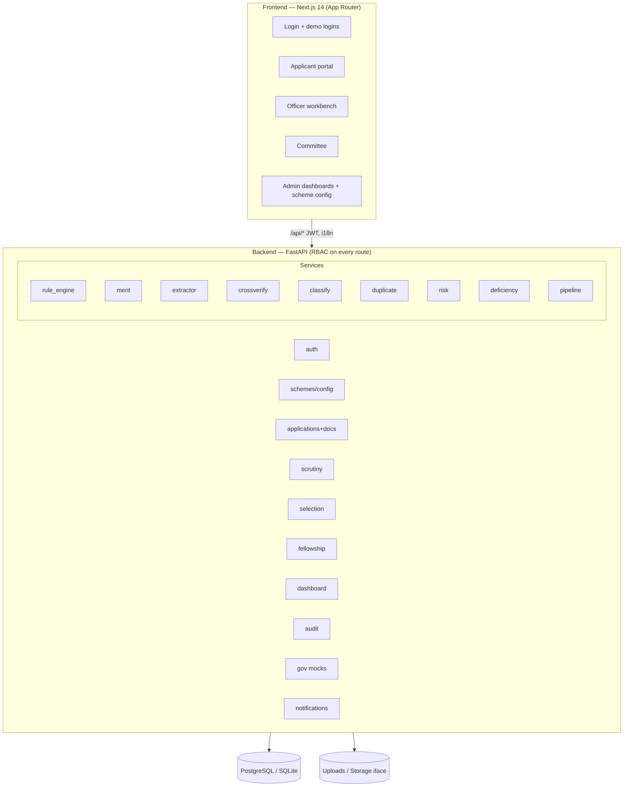
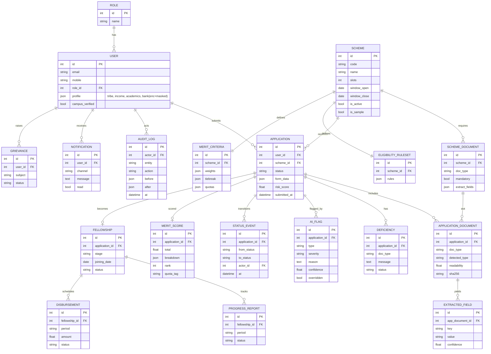
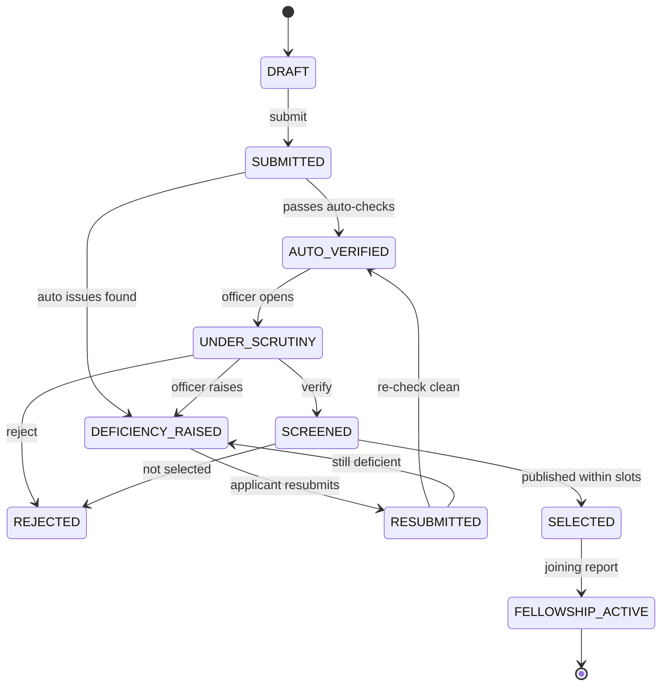

# Architecture

## Component view

## Entity-Relationship diagram

## Application status lifecycle

## Design principles
- **Configuration over code** — schemes are data (rules, documents, weights).
- **AI assists, humans decide** — every flag has a reason + confidence, is overridable,
  and overrides are audited.
- **Transparency** — eligibility and merit always show *why* (per-rule / per-criterion).
- **Security & privacy** — RBAC everywhere; PII encrypted at rest, matched via
  fingerprint, masked in every response.
- **Swappable integrations** — storage, extractor and gov APIs sit behind interfaces;
  mocks are clearly labelled and drop-in replaceable.
